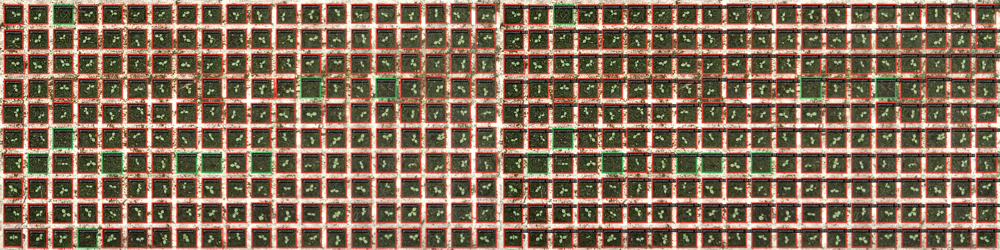
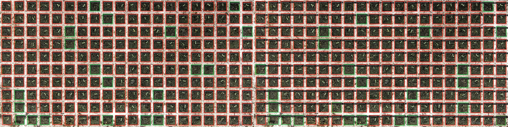

# 出苗率检测（Task1）项目方案文档

## 1. 项目目标

本任务的核心是为苗情图像算法建立一套可复用、可扩展的数据工程流程，服务后续模型训练与业务验证。

数据准备：

1. 建立稳定的数据切分流程（按类别、可复现、支持小样本保护）。
2. 明确已标注与未标注数据分层，支持分阶段标注与迭代训练。
3. 为后续训练、验证、测试与发芽率业务评估打好数据基础。

## 2. 场景与数据说明

数据按生长阶段分为三个类别：

1. 出苗期
2. 出苗期至小十字期
3. 小十字期

原始输入目录为 data/，每个类别一个子目录，目录内存放图像文件。

## 3. 整体技术路线

项目按三层推进：

1. 数据层：完成 train/val/test 切分，建立标注状态分层（labeled 和 unlabeled）。
2. 训练层：以 labeled 训练集为主，验证集与测试集全标注用于评估。
3. 业务层：基于测试集，验证发芽率等业务指标可落地性。

## 4. 数据集设计（目标状态）

### 4.1 输入

data/

### 4.2 处理

1. 按类别随机打乱，固定随机种子。
2. 按 8:1:1 比例切分为 train / val / test，对每个类别**独立执行**，切分数量使用 **ceil（向上取整）**：确保每个类别在 val 和 test 中各至少有 1 张，不允许某类别在任一集合中数量为 0。
3. 在 train 中按比例再切分 labeled 与 unlabeled（当前建议 labeled=10%，可配置）。
4. 预留 annotations 目录存放标注结果（按 train/val/test 组织）。

脚本位置需要：split_data/split_data.py

### 4.3 输出目录规范

split_data/

- train/
    - labeled/
    - unlabeled/
- val/
- test/
- annotations/
    - train/
    - val/
    - test/
---

脚本运行：

默认参数运行（val_ratio=0.1, test_ratio=0.1, labeled_ratio=0.1, seed=42）：

```bash
python split_data/split_data.py
```

自定义参数运行：

```bash
python split_data/split_data.py \
    --val_ratio 0.1 \
    --test_ratio 0.1 \
    --labeled_ratio 0.1 \
    --seed 42 \
    --overwrite
```

| 参数 | 默认值 | 说明 |
| ---- | ------ | ---- |
| `--val_ratio` | 0.1 | 验证集比例 |
| `--test_ratio` | 0.1 | 测试集比例 |
| `--labeled_ratio` | 0.1 | train 中 labeled 比例 |
| `--seed` | 42 | 随机种子，保证可复现 |
| `--overwrite` | False | 加此参数则清空输出目录后重建 |
| `--data_dir` | `../data` | 原始数据目录 |
| `--output_dir` | `../split_data` | 输出目录 |

---

### 4.4 标注类别

本按照任务目标检测出苗率设计包含两个标注类别：

| 类别名          | 含义   |
| --------------- | ------ |
| germinated      | 已发芽 |
| ungerminated    | 未发芽 |
图像标注示例：


标注标准：
1. 标注框基本按照血的位置边缘为土壤，当苗超出土壤，必须保证框住苗允许超出土壤
2. 对于苗的识别，当且仅当能完全确认为苗时，标注为出苗。
### 4.5 标注工具

推荐使用 X-AnyLabeling（支持目标检测/分割辅助标注）：

https://github.com/CVHub520/X-AnyLabeling/blob/main/docs/zh_cn/get_started.md


使用SAM-HQ(ViT-Base)辅助标注：


### 4.6 数据标注情况
split_data/
  |
  |__train 
  |   |__labeled  已标注
  |__val          已标注


## 5. 模型训练

### 5.1 任务类型

基于标注的 `germinated` / `ungerminated` 两类目标，当前定位为**目标检测任务**，在各生长阶段图像中检测并计数已发芽与未发芽种苗。

### 5.2 训练数据输入

- 图像：`split_data/train/labeled/`
- 标注：`split_data/annotations/train/`
- 标注格式：X-AnyLabeling 导出的 JSON 格式（后续可按模型框架需求转换为 YOLO / COCO 格式）

### 5.3 训练策略

1. 初始以 10% labeled 数据训练基线模型，确认流程可跑通。
2. 后续通过主动学习或人工筛选，从 unlabeled 中逐步补标高价值样本，扩充 labeled 集合。


### 5.4 模型方法

#### 5.4.1 全监督模型：faster-rcnn

[配置文件：train\mmdetection\configs\seedling-detection\faster-rcnn_r50_fpn_2x_coco.py](train\mmdetection\configs\seedling-detection\faster-rcnn_r50_fpn_2x_coco.py)<br>
[模型权重文件：train\mmdetection\work_dirs\faster-rcnn_r50_fpn_2x_coco\epoch_24.pth](train\mmdetection\work_dirs\faster-rcnn_r50_fpn_2x_coco\epoch_24.pth)<br>
测试结果文件：train\mmdetection\work_dirs\faster-rcnn_r50_fpn_2x_coco\20260427_232246

##### 1. 模型检测效果1
漏检率高

原因：
   - 标注缺失
   - fasterrcnn 模型 rpn 的“保留框上限 + NMS抑制”过紧
方法：
   - 补充遗漏标签
   - 调整上限，使用soft-nms.
   - 数据增强 ，RepeatDataset


###### 2. 模型检测效果2
测试结果文件：train\mmdetection\work_dirs\faster-rcnn_r50_fpn_2x_coco\20260427_232246
检测结果稍好
 


val 的评估结果：
{"coco/bbox_mAP": 0.664, "coco/bbox_mAP_50": 0.947, "coco/bbox_mAP_75": 0.938, "coco/bbox_mAP_s": -1.0, "coco/bbox_mAP_m": 0.865, "coco/bbox_mAP_l": -1.0, "data_time": 0.8706008394559225, "time": 0.9903814792633057}


#### 5.4.2 半监督模型：soft-teacher

[配置文件：soft-teacher_faster-rcnn_r50-caffe_fpn_180k_semi-0.1-seedlingdetection.py](train\mmdetection\configs\seedling-detection\soft-teacher_faster-rcnn_r50-caffe_fpn_180k_semi-0.1-seedlingdetection.py)

训练结果


可见还未拟合

改进策略：
  - 增大训练迭代次数
  - （可选）batchsize:原始4（标注图像为1：未标注图像3）调整3（标注图像为1：未标注图像2）
改进的配置：D:\农芯\图像算法面试作业\图像算法面试作业\task1\train\mmdetection\configs\seedling-detection\soft-teacher_faster-rcnn_r50-caffe_fpn_80k_semi-0.1-seedlingdetection.py
## 6. 模型部署

### 6.1 模型转换
进入mmdeploy目录下运行：

```
python.exe .\tools\deploy.py .\configs\mmdet\detection\detection_onnxruntime_dynamic.py ..\mmdetection\configs\seedling-detection\faster-rcnn_r50_fpn_2x_coco.py ..\mmdetection\work_dirs\faster-rcnn_r50_fpn_2x_coco\epoch_24.pth ..\..\split_data\test\1.3-6-wrap.jpg --work-dir mmdeploy_model/faster-rcnn-onnx --device cpu --dump-info
```

模型转换前后的推理效果对比：结果一致表示转换没问题
torch模型推理结果:

onnxnx模型推理结果:


### 6.2模型部署
模型部署到Xanylabeling
安装自定义模型推理部署：参考：https://github.com/CVHub520/X-AnyLabeling/blob/main/docs/zh_cn/custom_model.md

模型推理效果
阈值：0.8  漏检


阈值：0.5  误检


我的考虑是：保证不漏检的情况下，二次训练提示精度降低误检，因此阈值调初始设置为0.5，后续可自行调整。


## 7.发芽率预测

主要功能：统计苗盘的发芽率
文件解释在：[路径地址](train\post_process\README.md)

发芽率实际和预测，以及误差可视化


--- 
*本文档作为项目后续改造与实现的统一基线。调整比例、目录命名或标注策略时，应先更新本文件再改代码。*